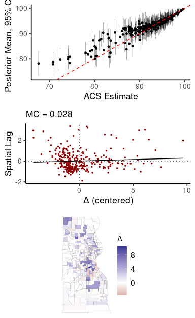
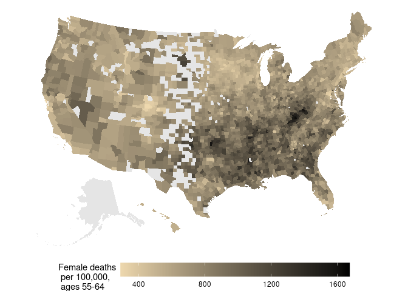

-   [A model for small-area survey
    data](#a-model-for-small-area-survey-data)
-   [CAR models in Stan](#car-models-in-stan)
-   [Working with the US county mortality
    data](#working-with-the-us-county-mortality-data)
-   [CAR model for all-cause mortality
    rates](#car-model-for-all-cause-mortality-rates)
-   [All-cause mortality and the Index of Concentration at the Extremes
    (ICE)](#all-cause-mortality-and-the-index-of-concentration-at-the-extremes-ice)
-   [R session info](#r-session-info)

This repository contains code and data for the paper:

> Donegan, Connor, Yongwan Chun and Daniel A. Griffith. 2021. **Modeling
> Community Health with Areal Data: Bayesian Inference with Survey
> Standard Errors and Spatial Structure** *International Journal of
> Environmental Research and Public Health* 18, no. 13: 6856.
> <https://doi.org/10.3390/ijerph18136856>.

The purpose of the repository is to demonstrate implementation of the
methodology and to share the underlying R and Stan code. For discussion
and details, see the published article. For the R scripts used to create
the figures and results reported in the paper, see the online
supplementary material published with the article. For details on
CAR models in Stan, see this [preprint](https://osf.io/3ey65/).

The methodology described below is now implemented in the [geostan](https://connordonegan.github.io/geostan/)
R package, including the HBMs and diagnostic plots.

### A model for small-area survey data

This section provides Stan code for implementing the models for small
area survey data, as presented in Section 3 of the article.

To demonstrate the methodology, we model American Community Survey
estimates of health insurance coverage rates for Milwaukee County census
tracts. This code chunk loads the file `tract-data.rds`, a simple
features (`sf`) object. (The data, without geometry, is also stored as
`acs-data.csv`.)

``` r
pkgs <- c("tidyverse", "spdep", "sf", "rstan")
silent=lapply(pkgs, require, character.only = TRUE)
rstan_options(auto_write = TRUE, javascript = FALSE)
```

``` r
## source some functions
source("r-functions.R")

## compile the Stan model
car.hbm <- stan_model("stan/data-model-CAR.stan")

## prepare data to pass to Stan:
# read in the data
df = read_rds("data/tract-data.rds")
# create a binary spatial adjacency matrix
A <- spdep::nb2mat(spdep::poly2nb(df), style = "B")
# convert it to a list with all the information required for our CAR model
dl <- prep_car_data(A)
# add survey estimates and standard errors to the list
dl$z <- df$insurance
dl$z_se <- df$insurance.se
dl$n <- nrow(df)
## specify priors based on our vague prior information (degrees of freedom, location, and scale of a Student's t distribution)
dl$prior_mu <- c(10, 80, 20)
dl$prior_tau <- c(10, 20, 20)

## draw samples from the posterior distribution of parameters (requires about 10 seconds)
S <- sampling(car.hbm, data = dl, chains = 4, cores = 4)
```

The following code chunk prints convergence diagnostics (split Rhat) and
effective sample sizes. The effective sample size (ESS) is relevant,
nominal sample size (i.e., actual number of samples drawn from the
posterior distribution) much less so. Increasing the ESS reduces the
MCMC standard error. Given the efficiency of the model (high ESS), we
could reduce sampling time by cutting down on the number of samples
collected, if needed:

``` r
## check MCMC diagnostics (Hamiltonian Monte Carlo)
check_hmc_diagnostics(S)
```

    ## 
    ## Divergences:

    ## 0 of 1600 iterations ended with a divergence.

    ## 
    ## Tree depth:

    ## 0 of 1600 iterations saturated the maximum tree depth of 10.

    ## 
    ## Energy:

    ## E-BFMI indicated no pathological behavior.

``` r
## Effective sample size and convergence (Rhat)
m <- monitor(S, print = FALSE)
quantile(m[,"Bulk_ESS"])
```

    ##     0%    25%    50%    75%   100% 
    ## 1031.0 2762.0 6082.5 6849.0 8764.0

``` r
quantile(m[,"Rhat"])
```

    ##        0%       25%       50%       75%      100% 
    ## 0.9993464 1.0006005 1.0007579 1.0013298 1.0048077

``` r
#stan_rhat(S)
#stan_ess(S)
```

The `plot.res` function is stored in the `r-functions.R` file, and it
provides the visual diagnostics discussed in the paper:

``` r
plot.res(S, z = dl$z, sf = df, W = dl$C)
```



The following code reports, first, the variance of the raw ACS estimates
for insurance coverage in Milwaukee County census tracts, and then, the
probability distribution for the actual variance of insurance coverage.
This shows, again, that the variance declines from 32 to (a posterior
mean/median of) 21:

``` r
var(dl$z)
```

    ## [1] 32.14744

``` r
x <- as.matrix(S, pars = "x")
quantile( apply(x, 1, var  ) )
```

    ##       0%      25%      50%      75%     100% 
    ## 15.54762 19.80351 20.98830 22.18820 27.48272

### CAR models in Stan

Stan does not have an efficient auto-Gaussian model specification
\`built in’. We wrote the following implementation for the log-pdf of
the auto-Gaussian model:

``` stan
/**
 * Log probability of the conditional autoregressive (CAR) model,
 * excluding additive constants.
 *
 * @param y Process to model
 * @param mu Mean vector
 * @param tau Scale parameter
 * @param rho Spatial dependence parameter
 * @param ImC Sparse representation of (I - C): non-zero values only
 * @param v Column indices for values in ImC
 * @param u Row starting indices for values in ImC
 * @param Cidx Indices for the off-diagonal elements in w
 * @param M_inv Diagonal elements from the inverse of the conditional  variances (M^-1), constant terms only
 * @param lambda Eigenvalues of M^{-1/2}*C*M^{1/2}
 * @param n Length of y
 *
 * @return Log probability density of CAR model up to additive constant
 *
 * @author Connor Donegan Connor.Donegan@UTDallas.edu
 *
 *@source 
 *
 * Donegan, Connor and Yongwan Chun and Daniel A. Griffith. 2021. "Modeling Community Health with Areal Data: Bayesian Inference with Survey Standard Errors and Spatial Structure." International Journal of Environmental Research and Public Health 18, no. 13: 6856. https://doi.org/10.3390/ijerph18136856.
 *
*/
real car_normal_lpdf(vector y, vector mu,
             real tau, real rho,
             vector ImC, int[] v, int[] u, int[] Cidx,
             vector M_inv, vector lambda,
             int n) {
  vector[n] z = y - mu;  
  vector[num_elements(ImC)] ImrhoC = ImC; // (I - rho C)
  vector[n] zMinv = z .* M_inv;           // z' * M^-1
  vector[n] ImrhoCz;                      // (I - rho * C) * z
  vector[n] ldet_prec;
  ImrhoC[Cidx] = rho * ImC[Cidx];
  ImrhoCz = csr_matrix_times_vector(n, n, ImrhoC, v, u, z);
  for (i in 1:n) ldet_prec[i] = log1m(rho * lambda[i]);
  return 0.5 * (
        -2 * n * log(tau)
        + sum(ldet_prec)
        - (1 / tau^2) * dot_product(zMinv, ImrhoCz)
        );
}
```

A benefit of this code is that it permits any valid CAR
model specification (e.g., distance weighted connectivity structures)
and it is computationally efficient.

The following R function prepares the input data for the CAR model. It
requires a binary spatial connectivity matrix as its argument:

``` r
#' Prepare data for Stan CAR model
#'
#' @param A  Binary adjacency matrix
#' @param lambda  If TRUE, return eigenvalues required for calculating the log determinant
#' of the precision matrix and for determining the range of permissible values of rho.
#' @param cmat  Return the full matrix C if TRUE.
#' 
#' @details
#'
#' The CAR model is Gauss(Mu, Sigma), Sigma = (I - rho C)^{-1} M.
#' This function implements the specification of C and M known as the
#' "neighborhoods" or "weighted" (WCAR) specification (see Cressie and Wikle 2011,
#' pp. 186-88, for CAR specifications).
#'
#' @source
#'
#'  Cressie, Noel and Christopher K. Wikle. Statistics for Spatio-Temporal Data. Wiley.
#'
#'  Donegan, Connor and Yongwan Chun and Daniel A. Griffith. 2021. "Modeling Community Health with Areal Data: Bayesian Inference with Survey Standard Errors and Spatial Structure." International Journal of Environmental Research and Public Health 18, no. 13: 6856. https://doi.org/10.3390/ijerph18136856.
#'
#' @return A list containing all of the data elements required by the Stan CAR model.
#'
#' @author Connor Donegan (Connor.Donegan@UTDallas.edu)
#' 
prep_car_data <- function(A, lambda = FALSE, cmat = TRUE) {
    n <- nrow(A)    
    Ni <- rowSums(A)
    C <- A / Ni
    M_diag <- 1 / Ni
    stopifnot( isSymmetric.matrix(C %*% diag(M_diag), check.attributes = FALSE) )
    car.dl <- rstan::extract_sparse_parts(diag(n) - C)
    car.dl$Cidx <- which( car.dl$w != 1 )
    car.dl$nImC <- length(car.dl$w)
    car.dl$nC <- length(car.dl$Cidx)
    car.dl$M_diag <- M_diag
    car.dl$n <- n
    if (lambda) {
        MCM <- diag( 1 / sqrt(M_diag) ) %*% C %*% diag( sqrt(M_diag) )
        lambda <- eigen(MCM)$values
        cat ("Range of permissible rho values: ", 1 / range(lambda), "\n")
        car.dl$lambda <- lambda
    }
    if (cmat) car.dl$C <- C
    return (car.dl)
}
```

The full Stan model for areal survey data is print below, and is also
stored in the file `stan/car-data-model.stan`. The CAR pdf is read in
from its own file, `CAR-functions.stan` (it must be stored in the same
directory as `car-data-model.stan`).

``` stan
functions {
#include CAR-functions.stan
}

data {
  int n;
  vector[n] z;
  vector[n] z_se;
  // priors
  vector[3] prior_mu;
  vector[3] prior_tau;
  // CAR data
  matrix[n, n] C;
  int nImC;
  int nC;
  vector[nImC] w;
  int v[nImC];
  int u[n + 1];
  int Cidx[nC];
  vector[n] M_diag;
}

transformed data {
  vector[n] lambda = eMCM(C, M_diag);
  vector[n] M_inv = 1 ./ M_diag;  
}

parameters {
  vector[n] x;  
  real mu;
  real<lower=0> tau;
  real<lower=1/min(lambda), upper=1/max(lambda)> rho;
}

transformed parameters {
}

model {
  z ~ normal(x, z_se);
  x ~ car_normal(rep_vector(mu, n), tau, rho, w, v, u, Cidx, M_inv, lambda, n);
  mu ~ student_t(prior_mu[1], prior_mu[2], prior_mu[3]);
  tau ~ student_t(prior_tau[1], prior_tau[2], prior_tau[3]);
 }

generated quantities {
  vector[n] delta = x - z;
  vector[n] trend = rho * C * (z - mu);
}
```

### Working with the US county mortality data

The following code chunk shows how to read in the county mortality data
and the connectivity structure. This is written to have no dependence on
external packages. The male mortality data may be loaded by simply
replacing all instaces of \`\`female’’ with ‘’male’’ in the following
code chunk.

``` r
## read in a data.frame with all the mortality and county ACS data
df = read.csv("data/county-data.csv")

## read in the connectivity structure
A <- read.csv("data/county-connectivity-female-df.csv")
## GEOIDs are in the column names
x = names(A)
## drop the leading character (read.csv prepends an X to the column names)
geos <- as.numeric( gsub("X", "", x) )
## convert A from data.frame to matrix
A <- as.matrix(A)

## this code ensures that the connectivity matrix is aligned with the mortality data
   ## this is equilivalent to: drop Alaska, drop missing values of deaths.female, drop missing values of ICE.
female.df <- df[ which( df$GEOID %in% geos ) , ]
## check that the order is correct
all( female.df$GEOID == geos )
```

    ## [1] TRUE

``` r
## GEOIDs are all five digits, zero-padded on the left when needed
female.df$GEOID <- str_pad(female.df$GEOID, width = 5, pad = "0", side = "left")
## double check this all aligns correctly: calculate Moran coefficient for log-mortality rates
mc( log(female.df$rate.female), A )
```

    ## [1] 0.568

### CAR model for all-cause mortality rates

The paper uses an intrinsic conditional autoregressive (ICAR) model to
capture spatial autocorrelation in the mortality rates. This code shows
how to use the CAR model for the mortality rates. This is actually much
more efficient than the ICAR model, and does not require any adjustments
for the disconnected graph structure.

Below is a Stan model for the mortality rates (without covariates).
Notice that the mean log-mortality rate, `alpha`, enters into the mean
of the CAR model. When covariates are added to the model, they should
also be added in this manner. Specifically, if we have a covariate, `x`,
and coefficient, `beta`, then the mean of the CAR model would become:
`vector[n] phi_mu = alpha + x * beta;`

``` stan
functions {
#include CAR-functions.stan
}

data {
 // mortality data
  int n;
  int y[n];
  vector[n] log_at_risk;
  // CAR data
  int nImC;
  int nC;
  vector[nImC] w;
  int v[nImC];
  int u[n + 1];
  int Cidx[nC];
  vector[n] M_diag;
  // connectivity matrix (C), or eigenvalues (lambda)
  matrix[n, n] C;
//  vector[n] lambda;
}

transformed data {
  // calculate eigenvalues if not provided as data
  vector[n] lambda = eMCM(C, M_diag);
  vector[n] M_inv = 1 ./ M_diag;  
}

parameters {
  // mean county-level log-mortality rate
  real alpha;
  // log-mortality rates
  vector[n] phi;
  // CAR parameters for phi
  real<lower=0> tau;
  real<lower=1/min(lambda), upper=1/max(lambda)> rho;
}

transformed parameters {
  vector[n] y_mu = log_at_risk + phi; 
}

model {
  vector[n] phi_mu = rep_vector(alpha, n);
  y ~ poisson_log(y_mu);
  phi ~ car_normal(phi_mu, tau, rho, w, v, u, Cidx, M_inv, lambda, n);
  // prior distributions on alpha and tau
    // (this is not a 'default' prior for alpha---these should be based on your subject matter)
  alpha ~ normal(-5, 5);
  tau ~ std_normal();
 }

generated quantities {
  vector[n] log_lik;
  vector[n] yrep;
  vector[n] residual;
  vector[n] fitted;
  for (i in 1:n) {
    fitted[i] = exp(y_mu[i]);
    residual[i] = fitted[i] - y[i];
    log_lik[i] = poisson_log_lpmf(y[i] | y_mu[i]);
    if (y_mu[i] > 20) {
      print("f[i] too large (>20) for poisson_log_rng");
      yrep[i] = -1;
    } else {
    yrep[i] = poisson_log_rng(y_mu[i]);
    }
  }
}
```

``` r
## compile the Stan model
CAR_pois <- stan_model("stan/CAR-poisson.stan")
## prepare the data for Stan
car_dl <- prep_car_data(A, lambda = FALSE)
## add outcome data to the list
car_dl$y <- female.df$deaths.female
car_dl$log_at_risk <- log( female.df$pop.at.risk.female )
car_dl$n <- nrow(female.df)
## draw samples from the joint posterior distribution of parameters
S <- sampling(CAR_pois, data = car_dl, chains = 4, cores = 4, iter = 800, refresh = 400)
```

Check HMC diagnostics, effective sample size, and convergence:

``` r
## check MCMC diagnostics (Hamiltonian Monte Carlo)
check_hmc_diagnostics(S)
```

    ## 
    ## Divergences:

    ## 0 of 1600 iterations ended with a divergence.

    ## 
    ## Tree depth:

    ## 0 of 1600 iterations saturated the maximum tree depth of 10.

    ## 
    ## Energy:

    ## E-BFMI indicated no pathological behavior.

``` r
## Effective sample size and convergence (Rhat), etc.
m <- monitor(S, print = FALSE)
quantile(m[,"Bulk_ESS"])
```

    ##   0%  25%  50%  75% 100% 
    ##  421 2155 3369 3909 5127

``` r
quantile(m[,"Rhat"])
```

    ##        0%       25%       50%       75%      100% 
    ## 0.9977385 1.0005814 1.0021658 1.0044406 1.0186156

The log-mortality rates are stored in the parameter `phi`. Here we
calculate and map the mean of the posterior probability distributions
for each county mortality rate:

``` r
## county mortality rates per 100,000
phi <- as.matrix(S, pars = "phi")
phi <- exp( phi ) * 100e3
female.df$phi <- apply(phi, 2, mean)

## join results to a simple features spatial data frame
sp.df <- readr::read_rds("data/county-data.rds")
sp.df <- left_join(sp.df, female.df, by = "GEOID")

## map mortality rates
sp.df %>%
  ggplot() +
  geom_sf(aes(fill = phi),
          lwd = 0.01
          ) +
  scale_fill_gradient(
    low = "wheat2",
    high= "black", 
#    midpoint = alpha,
#    mid = "white",
    name = "Female deaths\n per 100,000,\n ages 55-64",
    na.value = "grey90"
  ) +
  theme_void() +
  theme(     
       legend.position = "bottom",
       legend.key.width = unit(2, 'cm')
       )  
```



### All-cause mortality and the Index of Concentration at the Extremes (ICE)

This section shows how to fit the female all-cause mortality model from
the paper, but again using the CAR model instead of the ICAR (BYM)
model.

We will re-use the same list of data for this model as for the previous
CAR model, but we add the covariate data, covariate standard errors, and
some prior parameters:

``` r
## ICE: index of concentration at the extremes
car_dl$z <- female.df$ICE - mean(female.df$ICE)
## ICE standard errors
car_dl$z_se <- female.df$ICE.se
## these are for the prior distribution, see the paper for details
car_dl$IQR <- 0.179
car_dl$RII_prior <- c(1.6, 0.3)
```

Compile the Stan model and then draw samples from the posterior
distribution of parameters:

``` r
## compile model
CAR_hbm <- stan_model("stan/CAR-HBM.stan")
## draw samples
S <- sampling(CAR_hbm, data = car_dl, chains = 4, cores = 4, iter = 800, refresh = 400)
```

Check HMC diagnostics, effective sample size, and convergence:

``` r
## check MCMC diagnostics (Hamiltonian Monte Carlo)
check_hmc_diagnostics(S)
```

    ## 
    ## Divergences:

    ## 0 of 1600 iterations ended with a divergence.

    ## 
    ## Tree depth:

    ## 0 of 1600 iterations saturated the maximum tree depth of 10.

    ## 
    ## Energy:

    ## E-BFMI indicated no pathological behavior.

``` r
## Effective sample size and convergence (Rhat), etc.
m <- monitor(S, print = FALSE)
quantile(m[,"Bulk_ESS"])
```

    ##   0%  25%  50%  75% 100% 
    ##  501 1809 2488 3026 5127

``` r
quantile(m[,"Rhat"])
```

    ##       0%      25%      50%      75%     100% 
    ## 0.997872 1.000501 1.001630 1.003476 1.026342

The following code produces a summary of the parameter values and
quantities of interest, including the mean county mortality rate and a
measure of inequality (the ratio of the 90th to 10th percentile of
counties ordered by their mortality rates):

``` r
## view some results 
print(S, pars = c("alpha", "beta1", "beta2", "phi_tau", "phi_rho"))
```

    ## Inference for Stan model: CAR-HBM.
    ## 4 chains, each with iter=800; warmup=400; thin=1; 
    ## post-warmup draws per chain=400, total post-warmup draws=1600.
    ## 
    ##          mean se_mean   sd  2.5%   25%   50%   75% 97.5% n_eff Rhat
    ## alpha   -4.86       0 0.06 -4.98 -4.89 -4.86 -4.82 -4.74   763    1
    ## beta1    0.31       0 0.07  0.18  0.27  0.31  0.36  0.45  1877    1
    ## beta2   -1.67       0 0.03 -1.74 -1.69 -1.67 -1.65 -1.61  1358    1
    ## phi_tau  0.23       0 0.01  0.22  0.23  0.23  0.24  0.24   684    1
    ## phi_rho  1.00       0 0.00  1.00  1.00  1.00  1.00  1.00  1868    1
    ## 
    ## Samples were drawn using NUTS(diag_e) at Sun Aug  1 10:58:39 2021.
    ## For each parameter, n_eff is a crude measure of effective sample size,
    ## and Rhat is the potential scale reduction factor on split chains (at 
    ## convergence, Rhat=1).

``` r
# 90% cred. interval for the mean county mortality rate per 100,000 
alpha <- exp( as.matrix(S, pars = "alpha") )
quantile(alpha, probs = c(0.05, 0.95)) * 100e3
```

    ##       5%      95% 
    ## 708.4216 852.0208

``` r
# inequality in county mortality rates per 100,000
phi <- as.matrix(S, pars = "phi")
phi <- exp(phi)
Q10 <- apply(phi, 1, quantile, probs = 0.1)
Q90 <- apply(phi, 1, quantile, probs = 0.90)
## the 10th percentile:
mean(Q10) * 100e3
```

    ## [1] 528.9226

``` r
## the 90th percentile:
mean(Q90) * 100e3
```

    ## [1] 1117.132

``` r
## Relative index of inequality: p90/p10:
mean( Q90 / Q10 )
```

    ## [1] 2.112162

### R session info

``` r
sessionInfo()
```

    ## R version 4.1.0 (2021-05-18)
    ## Platform: x86_64-pc-linux-gnu (64-bit)
    ## Running under: Ubuntu 20.04.2 LTS
    ## 
    ## Matrix products: default
    ## BLAS:   /usr/lib/x86_64-linux-gnu/blas/libblas.so.3.9.0
    ## LAPACK: /usr/lib/x86_64-linux-gnu/lapack/liblapack.so.3.9.0
    ## 
    ## locale:
    ##  [1] LC_CTYPE=en_US.UTF-8       LC_NUMERIC=C              
    ##  [3] LC_TIME=en_US.UTF-8        LC_COLLATE=en_US.UTF-8    
    ##  [5] LC_MONETARY=en_US.UTF-8    LC_MESSAGES=en_US.UTF-8   
    ##  [7] LC_PAPER=en_US.UTF-8       LC_NAME=C                 
    ##  [9] LC_ADDRESS=C               LC_TELEPHONE=C            
    ## [11] LC_MEASUREMENT=en_US.UTF-8 LC_IDENTIFICATION=C       
    ## 
    ## attached base packages:
    ## [1] stats     graphics  grDevices utils     datasets  methods   base     
    ## 
    ## other attached packages:
    ##  [1] rstan_2.21.3         StanHeaders_2.21.0-7 spdep_1.1-8         
    ##  [4] sf_0.9-7             spData_0.3.10        sp_1.4-5            
    ##  [7] forcats_0.5.0        stringr_1.4.0        dplyr_1.0.3         
    ## [10] purrr_0.3.4          readr_1.4.0          tidyr_1.1.2         
    ## [13] tibble_3.0.5         ggplot2_3.3.3        tidyverse_1.3.0     
    ## 
    ## loaded via a namespace (and not attached):
    ##  [1] nlme_3.1-152       matrixStats_0.57.0 fs_1.5.0           lubridate_1.7.9.2 
    ##  [5] gmodels_2.18.1     httr_1.4.2         tools_4.1.0        backports_1.2.1   
    ##  [9] R6_2.5.0           KernSmooth_2.23-20 mgcv_1.8-36        DBI_1.1.1         
    ## [13] colorspace_2.0-0   raster_3.4-13      withr_2.4.0        gridExtra_2.3     
    ## [17] tidyselect_1.1.0   prettyunits_1.1.1  processx_3.4.5     curl_4.3          
    ## [21] compiler_4.1.0     cli_3.0.1          rvest_0.3.6        expm_0.999-6      
    ## [25] xml2_1.3.2         labeling_0.4.2     scales_1.1.1       classInt_0.4-3    
    ## [29] callr_3.5.1        proxy_0.4-26       digest_0.6.27      rmarkdown_2.6     
    ## [33] pkgconfig_2.0.3    htmltools_0.5.1    dbplyr_2.0.0       rlang_0.4.10      
    ## [37] readxl_1.3.1       rstudioapi_0.13    farver_2.0.3       generics_0.1.0    
    ## [41] jsonlite_1.7.2     gtools_3.8.2       inline_0.3.17      magrittr_2.0.1    
    ## [45] loo_2.4.1          Matrix_1.3-4       Rcpp_1.0.7         munsell_0.5.0     
    ## [49] lifecycle_0.2.0    stringi_1.5.3      yaml_2.2.1         MASS_7.3-54       
    ## [53] pkgbuild_1.2.0     grid_4.1.0         parallel_4.1.0     gdata_2.18.0      
    ## [57] crayon_1.3.4       deldir_0.2-10      lattice_0.20-44    haven_2.3.1       
    ## [61] splines_4.1.0      hms_1.0.0          knitr_1.30         ps_1.5.0          
    ## [65] pillar_1.4.7       boot_1.3-28        codetools_0.2-18   stats4_4.1.0      
    ## [69] LearnBayes_2.15.1  reprex_0.3.0       glue_1.4.2         evaluate_0.14     
    ## [73] V8_3.4.0           RcppParallel_5.1.4 modelr_0.1.8       vctrs_0.3.6       
    ## [77] cellranger_1.1.0   gtable_0.3.0       assertthat_0.2.1   xfun_0.20         
    ## [81] broom_0.7.3        e1071_1.7-8        coda_0.19-4        class_7.3-19      
    ## [85] units_0.7-2        ellipsis_0.3.1
